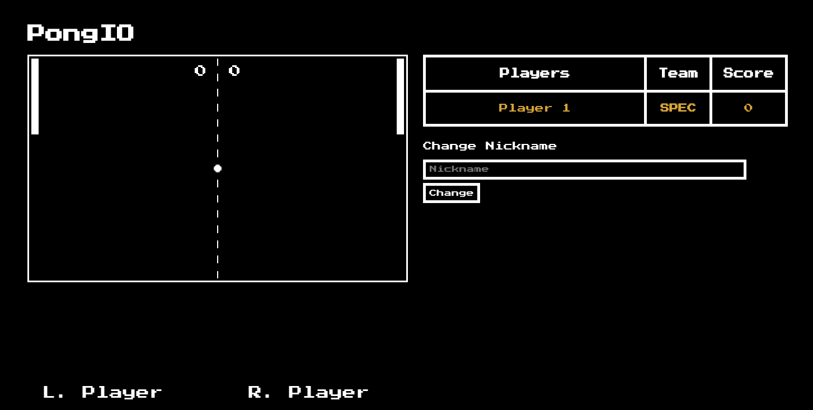

<p align="center">
  
</p>
                                                                         
PongIO is an implementation of the classic Atari game in javascript with multiplayer support

 

## Installation

Just install like any other node application

```bash
$ npm install

$ npm start
```

## Usage

By default the application is listening to the port 3000. So you can connect to your ip and enjoy the game. Just make sure you have somebody to play with, because the game only supports multiplayer and not singleplayer

## Features
- [x] Nickname support
- [x] Live scoreboard
- [x] Simple usage
- [ ] Room support

## Contributing
Pull requests are welcome. For major changes, please open an issue first to discuss what you would like to change.

Please make sure to update tests as appropriate.

## License
[MIT](https://choosealicense.com/licenses/mit/)
